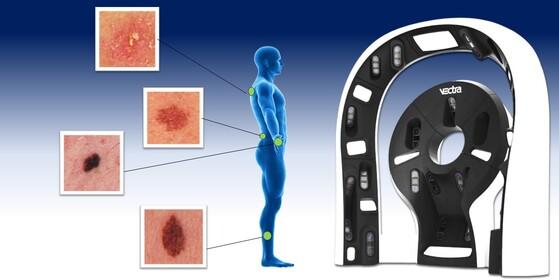

# Group 7 ISIC 2024 Skin Cancer Detection Model 

The project includes both python (.py) and python notebook (.ipynb) files. Additionally included is the training data. Please follow the directions below and set the needed environmental variables.



https://www.kaggle.com/competitions/isic-2024-challenge
* `train.py`: Script that trains and tests a simple model 
* `isic-2024.ipynb`: Same as train.py, but in a Jupyter Notebook format
## Running `train.py`

#### Using pip

1. Install dependencies
   #### Windows
2. ```bash
   pip install -r requirements.txt
   ```
   #### Linux/MacOS
    ````bash
   pip3 install -r requirments.txt

3. Set enviromental variables
   #### Windows (Powershell)
   ```bash
   [Environment]::SetEnvironmentVariable('CWD', (Get-Location).Path, 'Process')
   [Environment]::SetEnvironmentVariable('TRAIN_CSV', "$CWD\isic-2024-challenge\train-metadata.csv", 'Process')
   [Environment]::SetEnvironmentVariable('TEST_CSV', "$CWD\isic-2024-challenge\test-metadata.csv", 'Process')
   [Environment]::SetEnvironmentVariable('TRAIN_HDF5', "$CWD\isic-2024-challenge\train-image.hdf5", 'Process')
   [Environment]::SetEnvironmentVariable('TEST_HDF5', "$CWD\isic-2024-challenge\dev-image.hdf5", 'Process')
   ````

   #### Linux/MacOS
   ```bash
   cat << 'EOF' > environment.config
   $CWD=\$(pwd)
   TRAIN_CSV=\${CWD}/isic-2024-challenge/train-metadata.csv
   TEST_CSV=\${CWD}/isic-2024-challenge/test-metadata.csv
   TRAIN_HDF5=\${CWD}/isic-2024-challenge/train-image.hdf5
   TEST_HDF5=\${CWD}/isic-2024-challenge/test-image.hdf5
   EOF
   source environment.config
   ```


3. Run the script

   #### Windows
   ```bash
   python train.py
   ```
   #### Linux/MacOS
   ```bash
   python3 train.py
   ```
